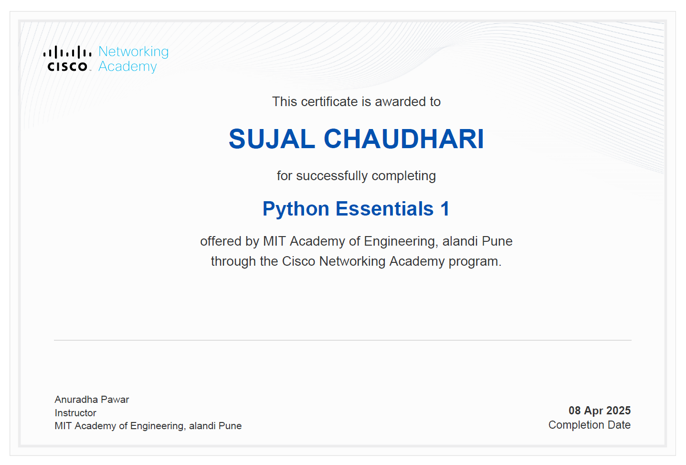
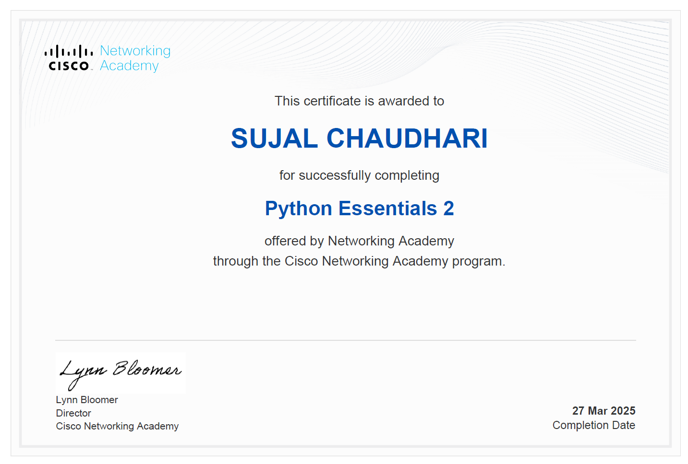
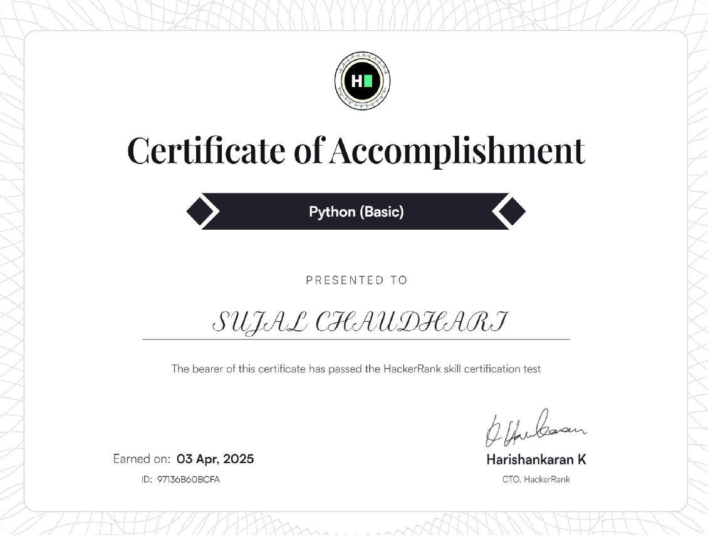

# Portfolio-Project

<!DOCTYPE html>
<html lang="en">

<head>
    <meta charset="UTF-8" />
    <meta name="viewport" content="width=device-width, initial-scale=1.0" />
    <title>Sujal Chaudhari's Dynamic Portfolio</title>
    <link rel="stylesheet" href="https://cdnjs.cloudflare.com/ajax/libs/font-awesome/6.5.2/css/all.min.css"
        integrity="sha512-SnH5WK+bZxgPHs44uWIX+LLJAJ9/2PkPKZ5QiAj6Ta86w+fsb2TkcmfRyVX3pBnMFcV7oQPJkl9QevSCWr3W6A=="
        crossorigin="anonymous" referrerpolicy="no-referrer" />
    
</head>

<body>

    

        <section class="landing" id="landing-page">
            <h1>Welcome to My </h1>
            <h1>    Portfolio</h1> 
Hi, I'm Sujal Chaudhari — Web Developer | AIML | Creator | Gamer. Let’s dive into my work!

            <a href="#about" class="enter-btn" data-page="page-about">Explore My Work</a>
        </section>

        

            <nav class="page-nav">
                <a href="#about" data-page="page-about" class="active-nav-link">About</a>
                <a href="#skills" data-page="page-skills">Skills</a>
                <a href="#projects" data-page="page-projects">Projects</a>
                <a href="#certifications" data-page="page-certifications">Certifications</a>
                <a href="#hobbies" data-page="page-hobbies">Hobbies</a>
                <a href="#contact" data-page="page-contact">Contact</a>
            </nav>
            

                <h2>About Me</h2>
                

                    

                        
                    

                    

                        
Hi everyone, I’m Sujal, a creative soul driven by storytelling and design. I am currently pursuing my degree in Computer Science at MIT Academy of Engineering. With a deep passion for technology and problem-solving, I thrive in building efficient, scalable, and user-friendly solutions.

                        
My approach to work combines creativity, efficiency, and problem-solving, allowing me to craft meaningful and impactful projects. I thrive on challenges and am always eager to learn and grow. Over the years, I have worked on diverse projects that have strengthened my skills in web development and beyond.

                        
Now talking about my Schooling life, I have completed my high school and junior college from Jajoo English Medium School in my hometown Yavatmal, Maharashtra. I was mainly an average guy who tries to do better in academics and extra-curriculars as well.

                        <h2>Achievements:</h2>
                        
My some of the early Achievements are:
                            1.SSC: Got 90%.
                            2.HSC:Got 85%.
                            3.CET:Got 95.26 %ile.
                            4.JEE:86 %ile.
                            5.Qualified For JEE Adv.
                            6.Won prises on chess and batbinton school level Tournament.
                        

                    

                

            

            <footer>
                

                    

                        <a href="mailto:sujalchaudhari0211@gmail.com" aria-label="Email"><i class="fas fa-envelope"></i></a>
                        <a href="https://www.linkedin.com/in/sujalchaudhari0211" target="_blank" aria-label="LinkedIn"><i class="fab fa-linkedin"></i></a>
                        <a href="https://github.com/sujalchaudhari0211" target="_blank" aria-label="GitHub"><i class="fab fa-github"></i></a>
                    

                    

                        
Website Visitors:

                        0 

                    
&copy; 2025 Sujal Chaudhari. Crafted with Code & Passion.

                

            </footer>
        

        

             <nav class="page-nav">
                <a href="#about" data-page="page-about">About</a>
                <a href="#skills" data-page="page-skills" class="active-nav-link">Skills</a>
                <a href="#projects" data-page="page-projects">Projects</a>
                <a href="#certifications" data-page="page-certifications">Certifications</a>
                <a href="#hobbies" data-page="page-hobbies">Hobbies</a>
                <a href="#contact" data-page="page-contact">Contact</a>
            </nav>
            

                <h2>Core Skills</h2>
                

                     
<h4>Programming</h4>
PythonJavaC++JS

                     
<h4>Web Dev</h4>
HTMLCSSJavaScriptReactNode.js

                     
<h4>Tools</h4>
GitVS CodePhotoshop

                     
<h4>Soft Skills</h4>
TeamworkLeadership

                

            

            <footer>
                

                     

                        <a href="mailto:sujalchaudhari0211@gmail.com" aria-label="Email"><i class="fas fa-envelope"></i></a>
                        <a href="https://www.linkedin.com/in/sujalchaudhari0211" target="_blank" aria-label="LinkedIn"><i class="fab fa-linkedin"></i></a>
                        <a href="https://github.com/sujalchaudhari0211" target="_blank" aria-label="GitHub"><i class="fab fa-github"></i></a>
                     

                     

                        
Website Visitors:

                        0
                     

                    
&copy; 2025 Sujal Chaudhari. Crafted with Code & Passion.

                

            </footer>
        

        

             <nav class="page-nav">
                <a href="#about" data-page="page-about">About</a>
                <a href="#skills" data-page="page-skills">Skills</a>
                <a href="#projects" data-page="page-projects" class="active-nav-link">Projects</a>
                <a href="#certifications" data-page="page-certifications">Certifications</a>
                <a href="#hobbies" data-page="page-hobbies">Hobbies</a>
                <a href="#contact" data-page="page-contact">Contact</a>
            </nav>
            

                <h2>My Projects</h2>
                

                    

                        
                        <h3>🎬Movie Recommender System</h3>
                         
A system that suggests movies based on viewing history using collaborative filtering.

Built with: Python, Pandas, Scikit-learn, Streamlit

Trained on: MovieLens dataset
- I created this as a project in my 10th grade.

                    

                    

                        
                        <h3>🧪SmartLab: Virtual Chemistry Lab Simulator</h3>
                         
A simulation app where students can perform chemistry experiments safely in 3D.

Built with: Unity or WebGL + JavaScript

Features: Beaker mixing, reaction predictions, safety warnings

                    

                    

                         
                        <h3>🌱Plant Growth Under Colored LED Lights</h3>
                         
Tested how different light wavelengths affect plant growth.

Setup: Same plant species, 4 different light colors, controlled watering

Results tracked with growth charts and photos over 30 days

                    

                     

            

            <footer>
                

                     

                         <a href="mailto:sujalchaudhari0211@gmail.com" aria-label="Email"><i class="fas fa-envelope"></i></a>
                         <a href="https://www.linkedin.com/in/sujalchaudhari0211" target="_blank" aria-label="LinkedIn"><i class="fab fa-linkedin"></i></a>
                         <a href="https://github.com/sujalchaudhari0211" target="_blank" aria-label="GitHub"><i class="fab fa-github"></i></a>
                     

                     

                         
Website Visitors:

                         0
                     

                    
&copy; 2025 Sujal Chaudhari. Crafted with Code & Passion.

                

            </footer>
        

        

             <nav class="page-nav">
                <a href="#about" data-page="page-about">About</a>
                <a href="#skills" data-page="page-skills">Skills</a>
                <a href="#projects" data-page="page-projects">Projects</a>
                <a href="#certifications" data-page="page-certifications" class="active-nav-link">Certifications</a>
                <a href="#hobbies" data-page="page-hobbies">Hobbies</a>
                <a href="#contact" data-page="page-contact">Contact</a>
            </nav>
             

                 <h2>Certifications</h2>
                 
 
 <h4>Python Essentials 1</h4>
                         
                         
MIT Academy of Engineering, Pune

                         
<strong>Date:</strong> April 8, 2025

                         <a href="PE1.pdf" target="_blank">View Certificate</a>
                     

                     

                         <h4>Python Essentials 2</h4>
                         
                         
Cisco Networking Academy

                         
<strong>Date:</strong> March 27, 2025

                         <a href="PE2.pdf" target="_blank">View Certificate</a>
                     

                     

                         <h4>Python (Basic)</h4>
                         
                         
HackerRank

                         
<strong>Date:</strong> April 3, 2025

                         <a href="PyB.pdf" target="_blank">View Certificate</a>
                     

                     

             

             <footer>
                 

                     

                         <a href="mailto:sujalchaudhari0211@gmail.com" aria-label="Email"><i class="fas fa-envelope"></i></a>
                         <a href="https://www.linkedin.com/in/sujalchaudhari0211" target="_blank" aria-label="LinkedIn"><i class="fab fa-linkedin"></i></a>
                         <a href="https://github.com/sujalchaudhari0211" target="_blank" aria-label="GitHub"><i class="fab fa-github"></i></a>
                     

                     

                         
Website Visitors:

                         0
                     

                     
&copy; 2025 Sujal Chaudhari. Crafted with Code & Passion.

                 

             </footer>
         

         

              <nav class="page-nav">
                 <a href="#about" data-page="page-about">About</a>
                 <a href="#skills" data-page="page-skills">Skills</a>
                 <a href="#projects" data-page="page-projects">Projects</a>
                 <a href="#certifications" data-page="page-certifications">Certifications</a>
                 <a href="#hobbies" data-page="page-hobbies" class="active-nav-link">Hobbies</a>
                 <a href="#contact" data-page="page-contact">Contact</a>
             </nav>
             

                 <h2>Hobbies & Interests</h2>
                 

                     

                         🎮
                         <h4>Gaming</h4>
                         
Exploring virtual worlds and competitive gaming.

                     

                     

                         💻
                         <h4>Coding</h4>
                         
Building side projects and learning new tech.

                     

                     

                         🎬
                         <h4>Movies & Series</h4>
                         
Enjoying captivating stories on screen.

                     

                     

                         🎵
                         <h4>Music</h4>
                         
Listening to various genres, discovering new artists.

                     

                     

             

             <footer>
                 

                     

                         <a href="mailto:sujalchaudhari0211@gmail.com" aria-label="Email"><i class="fas fa-envelope"></i></a>
                         <a href="https://www.linkedin.com/in/sujalchaudhari0211" target="_blank" aria-label="LinkedIn"><i class="fab fa-linkedin"></i></a>
                         <a href="https://github.com/sujalchaudhari0211" target="_blank" aria-label="GitHub"><i class="fab fa-github"></i></a>
                     

                     

                         
Website Visitors:

                         0
                     

                     
&copy; 2025 Sujal Chaudhari. Crafted with Code & Passion.

                 

             </footer>
         

         

              <nav class="page-nav">
                 <a href="#about" data-page="page-about">About</a>
                 <a href="#skills" data-page="page-skills">Skills</a>
                 <a href="#projects" data-page="page-projects">Projects</a>
                 <a href="#certifications" data-page="page-certifications">Certifications</a>
                 <a href="#hobbies" data-page="page-hobbies">Hobbies</a>
                 <a href="#contact" data-page="page-contact" class="active-nav-link">Contact</a>
             </nav>
             

                 <h2>Get In Touch</h2>
                 

                     

                         <h3>Contact Information</h3>
                         <ul>
                            <li><i class="fas fa-envelope"></i> <a href="mailto:sujalchaudhari0211@gmail.com">sujalchaudhari0211@gmail.com</a></li>
                            <li><i class="fab fa-linkedin"></i> <a href="https://www.linkedin.com/in/sujalchaudhari0211" target="_blank">LinkedIn Profile</a></li>
                            <li><i class="fab fa-github"></i> <a href="https://github.com/sujalchaudhari0211" target="_blank">GitHub Profile</a></li>
                            <li><i class="fas fa-map-marker-alt"></i> Pimpri-Chinchwad, Maharashtra, India</li> </ul>
                     

                     

                        <h3>Send Me a Message</h3>
                        <form class="contact-form" action="#" method="POST"> <label for="name">Name:</label>
                            <input type="text" id="name" name="name" required>

                            <label for="email">Email:</label>
                            <input type="email" id="email" name="email" required>

                            <label for="message">Message:</label>
                            <textarea id="message" name="message" required></textarea>

                            <button type="submit" class="enter-btn">Send Message</button>
                        </form>
                     

                 

             

             <footer>
                 

                     

                         <a href="mailto:sujalchaudhari0211@gmail.com" aria-label="Email"><i class="fas fa-envelope"></i></a>
                         <a href="https://www.linkedin.com/in/sujalchaudhari0211" target="_blank" aria-label="LinkedIn"><i class="fab fa-linkedin"></i></a>
                         <a href="https://github.com/sujalchaudhari0211" target="_blank" aria-label="GitHub"><i class="fab fa-github"></i></a>
                     

                     

                         
Website Visitors:

                         0
                     

                     
&copy; 2025 Sujal Chaudhari. Crafted with Code & Passion.

                 

             </footer>
         

    
 

</body>
</html>
